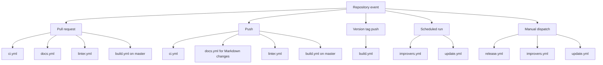

# Available workflows

This directory contains the GitHub Actions workflows used for CI validation,
container publishing, documentation checks, release automation, and scheduled
maintenance.

## Quick context

- `CI:` workflows validate Python changes with tests, coverage, mutation
  testing, linting, and static analysis.
- `Release:` workflows generate and publish AI-assisted changelogs and GitHub
  releases on demand.
- `Docs:` workflows validate documentation links and run the documentation
  quality suite.
- `Maintenance:` workflows periodically update dependencies and use Copilot
  CLI to propose technical-debt and coverage improvements.

Pull requests and pushes run the validation workflows.
Manual dispatch starts release and maintenance operations,
while scheduled workflows handle recurring repository upkeep.

## Execution map

The diagram below shows which workflows run for each repository event.
Use it as a quick orientation before reviewing the detailed table.

<!-- markdownlint-disable MD013 -->

| Workflow file                    | Purpose                                                                                                                                                                                                                                                           | Trigger                                                                                    |
| -------------------------------- | ----------------------------------------------------------------------------------------------------------------------------------------------------------------------------------------------------------------------------------------------------------------- | ------------------------------------------------------------------------------------------ |
| [build.yml](./build.yml)         | **CI: Build and publish the container image.** Runs Python unit tests across Python 3.12, 3.13, and 3.14. After the test matrix passes, builds the Docker image, publishes it to `ghcr.io` for non-pull-request runs, and creates a build-provenance attestation. | `workflow_dispatch`, pushes to `master` or `v*` tags, and pull requests targeting `master` |
| [ci.yml](./ci.yml)               | **CI: Run tests and enforce quality gates.** Runs unit tests with a 95% coverage threshold, exercises the local LLMock functional test suite, publishes diagnostics and summaries, and runs module-scoped mutation tests followed by a 95% mutation-score gate.   | Every `push` and `pull_request`                                                            |
| [docs.yml](./docs.yml)           | **Docs: Verify documentation.** Checks external Markdown links, then runs the project lint and test suite through the documentation-instructions job.                                                                                                             | Pushes that change Markdown files and every `pull_request`                                 |
| [improvers.yml](./improvers.yml) | **Maintenance: Propose quality improvements.** Runs monthly or on demand. One Copilot CLI job reduces technical debt and opens a pull request; another adds meaningful tests to improve coverage and opens a separate pull request.                               | Monthly schedule (`0 0 15 * *`) and `workflow_dispatch`                                    |
| [linter.yml](./linter.yml)       | **CI: Lint and inspect the codebase.** Counts source lines with `scc`, runs Super-Linter, and, when linting fails, collects diagnostics and creates an issue containing AI-assisted failure analysis.                                                             | Every `push` and `pull_request`                                                            |
| [release.yml](./release.yml)     | **Release: Generate and publish AI-assisted release notes.** Fetches Git notes, generates `CHANGELOG.md` and semantic version tags, commits changelog updates and notes, then creates a GitHub release using the newest tag and the latest changelog entries.     | `workflow_dispatch`                                                                        |
| [update.yml](./update.yml)       | **Maintenance: Update managed versions.** Runs weekly or on demand. Updates managed version files and opens a pull request, while a second job updates the Dockerfile and opens a pull request when a newer base image is available.                              | Weekly schedule (`0 0 * * 5`) and `workflow_dispatch`                                      |

<!-- markdownlint-enable MD013 -->

## Additional links

- [Code](../..)
- [Issues](https://github.com/electrocucaracha/ai-changelog/issues)
- [Pull requests](https://github.com/electrocucaracha/ai-changelog/pulls)
- [Actions](https://github.com/electrocucaracha/ai-changelog/actions)
- [Project root](../..)
