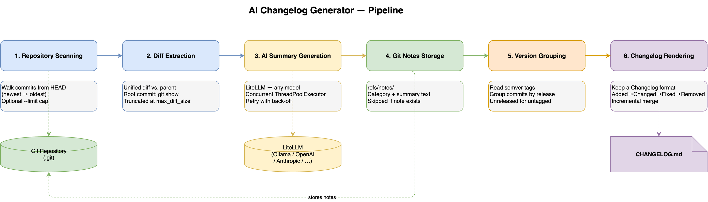

# How It Works

AI Changelog Generator automates release note creation by combining Git history with an AI model.
It reads every commit in your repository,
uses a language model to produce a human-readable summary of the diff,
stores those summaries as Git notes,
and then renders them into a structured `CHANGELOG.md` grouped by semantic version release.

The pipeline has six stages that run sequentially each time you invoke the CLI.



## 1. Repository scanning

The tool opens the target Git repository using [GitPython](https://gitpython.readthedocs.io/)
and walks commit history from `HEAD` backward, newest-first.

You can process the full history or cap the run to the most recent commits with `--limit`.
Capping is useful for large repositories or for incremental runs when you only want to
annotate commits added since the last execution.

> Note: `--limit` is incompatible with `--create-semver-tags`
> because partial history produces incorrect version numbers.

## 2. Diff extraction

For each commit the tool fetches a unified diff:

- **Normal commits** — diff is computed against the first parent commit.
- **Root commit** — `git show` is used so all initially added files appear.

Diffs larger than `max_diff_size` (default 50 000 characters) are truncated before
being sent to the model to stay within context-window limits.
This threshold is configurable via the `--max-diff-size` flag or the `CHANGELOG_MAX_DIFF_SIZE`
environment variable.

## 3. AI summary generation

Each diff is forwarded to the configured language model through
[LiteLLM](https://docs.litellm.ai/),
which provides a single interface to Ollama, OpenAI, Anthropic, and any other
LiteLLM-compatible model.

The model produces a one-sentence
[Keep a Changelog](https://keepachangelog.com/)–style entry and assigns a category:
`Added`, `Changed`, `Fixed`, or `Removed`.
The summary is also normalized to start with a domain-specific power verb
(for example, `Resolved`, `Introduced`, `Optimized`) for consistency.

Summaries are generated **concurrently** using a `ThreadPoolExecutor`.
The number of worker threads defaults to the host's CPU count
but can be overridden with `--workers`.
The CLI renders a per-worker progress bar during the run.

Transient failures (timeouts, rate-limit 429s, 5xx errors) are retried with
exponential back-off controlled by `--retry-attempts` and `--retry-backoff-seconds`.

When a commit already has a note in the target namespace and `--force` is not supplied,
the AI call is skipped and the existing note is reused.
This makes incremental runs cheap.

## 4. Git notes storage

Each generated summary is persisted as a
[Git note](https://git-scm.com/docs/git-notes)
under a dedicated namespace (default `ai-changelog`).

```text
refs/notes/ai-changelog  →  <commit-sha>  →  "Category: Fixed\n\nResolved…"
```

Notes are stored alongside the commit object without rewriting history.
They survive `git fetch` and `git push` when you include
`refs/notes/*` in your remote configuration,
so the summaries can be shared across machines and CI runs.

The stored note format embeds the category on the first line (`Category: Fixed`)
followed by an empty line and the summary sentence.
This structured layout lets the rendering stage parse category and text
from a single note read.

## 5. Semantic version tag and release grouping

Before rendering the changelog,
the tool reads all tags in the repository and filters for semantic version tags
(`vMAJOR.MINOR.PATCH` or `MAJOR.MINOR.PATCH`).

Commits are then grouped into release sections by the highest semantic version tag
that points to or precedes each commit.
Commits not yet covered by any tag fall into an `[Unreleased]` section.

### Automatic tag creation

When you pass `--create-semver-tags`,
the tool infers a release type from each commit's note category
and creates lightweight version tags automatically:

| Note category | Release type |
| ------------- | ------------ |
| `Added`       | `minor`      |
| `Changed`     | `patch`      |
| `Fixed`       | `patch`      |
| `Removed`     | `major`      |

Tags are created chronologically, starting from the highest existing tag or
`v1.0.0` if none exists.
Commits that already carry a semantic tag are skipped.

## 6. Changelog rendering

The tool builds a
[Keep a Changelog](https://keepachangelog.com/)–compliant `CHANGELOG.md`.

Within each release section,
entries are sorted into subsections in the canonical order:
**Added → Changed → Fixed → Removed**.

If `CHANGELOG.md` already exists,
the tool performs an **incremental merge**:
it parses the existing file,
identifies release sections that are already present,
and appends only the new or missing sections.
Existing content is never overwritten.
The `[Unreleased]` section is always updated to reflect commits not yet tagged.

The final output path is configurable via `--changelog-file`
(default `CHANGELOG.md` in the repository root).
